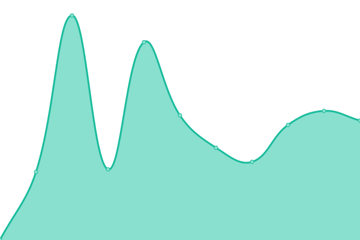
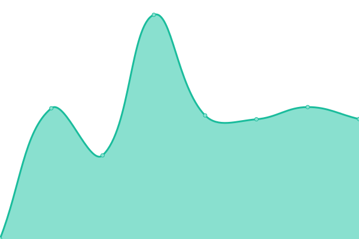

# [📈 Live Status](https://upptime.aid-ly.org): <!--live status--> **🟥 Complete outage**

This repository contains the open-source uptime monitor and status page for [aid-ly](https://aid-ly.org/?utm_source=github&utm_medium=profile), powered by [Upptime](https://github.com/upptime/upptime).

With [Upptime](https://upptime.js.org), you can get your own unlimited and free uptime monitor and status page, powered entirely by a GitHub repository. We use [Issues](https://github.com/aid-ly/upptime/issues) as incident reports, [Actions](https://github.com/aid-ly/upptime/actions) as uptime monitors, and [Pages](https://upptime.aid-ly.org) for the status page.

<!--start: status pages-->
<!-- This summary is generated by Upptime (https://github.com/upptime/upptime) -->
<!-- Do not edit this manually, your changes will be overwritten -->
<!-- prettier-ignore -->
| URL | Status | History | Response Time | Uptime |
| --- | ------ | ------- | ------------- | ------ |
|  [Aid-Ly](https://aid-ly.org) | 🟥 Down | [aid-ly.yml](https://github.com/aid-ly/upptime/commits/HEAD/history/aid-ly.yml) | 

 609ms
     
 | 

<a href="https://upptime.aid-ly.org/history/aid-ly">23.26%</a>
    

|  [Url Shortener](https://link.aid-ly.org) | 🟥 Down | [url-shortener.yml](https://github.com/aid-ly/upptime/commits/HEAD/history/url-shortener.yml) | 

 488ms
     
 | 

<a href="https://upptime.aid-ly.org/history/url-shortener">23.26%</a>
    

|  [Watchtower](https://watchtower.aid-ly.org) | 🟥 Down | [watchtower.yml](https://github.com/aid-ly/upptime/commits/HEAD/history/watchtower.yml) | 

 495ms
     
 | 

<a href="https://upptime.aid-ly.org/history/watchtower">20.68%</a>
    

<!--end: status pages-->

[**Visit our status website →**](https://upptime.aid-ly.org)

## 📄 License

- Powered by: [Upptime](https://github.com/upptime/upptime)
- Code: [MIT](./LICENSE) © [Anand Chowdhary](https://anandchowdhary.com), supported by [Pabio](https://pabio.com)
- Data in the `./history` directory: [Open Database License](https://opendatacommons.org/licenses/odbl/1-0/)
